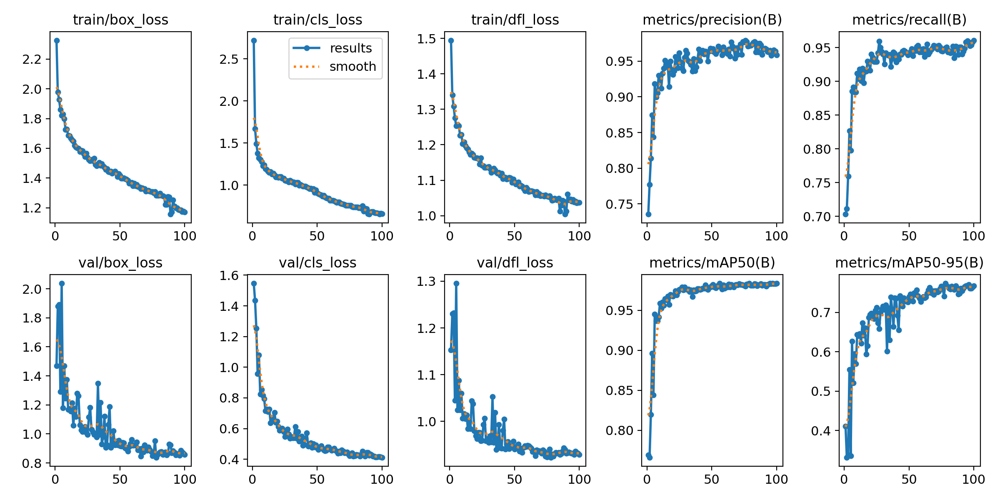
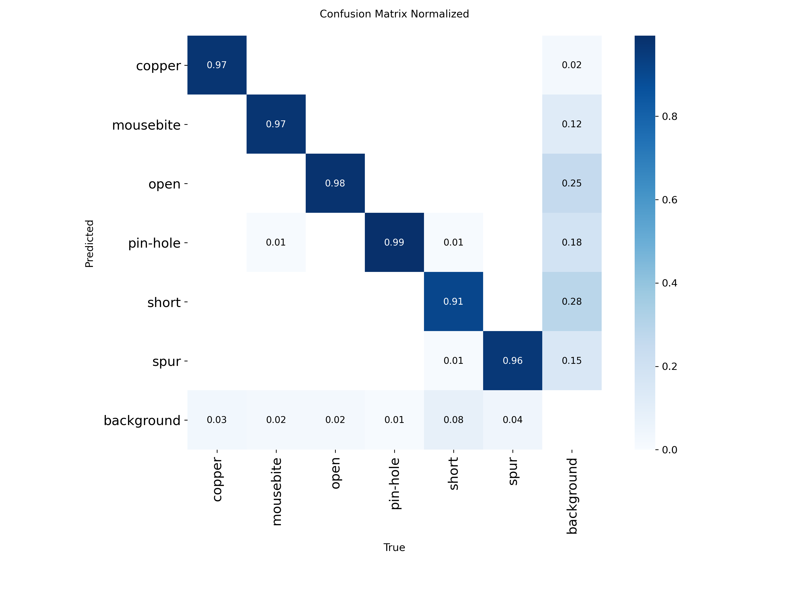
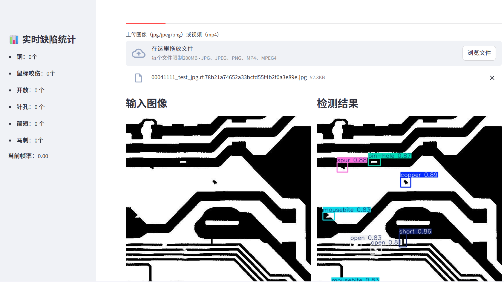
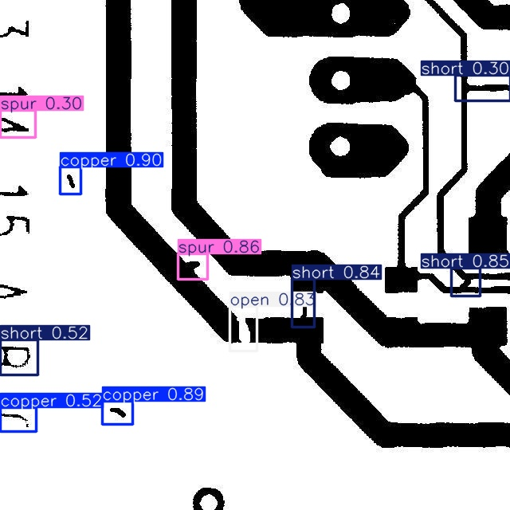

# YOLOv8 Industrial PCB Defect Detection

## Overview
YOLOv8n fine-tune for 6-class industrial PCB defects detection (mAP50 = 0.9826 from baseline 0.0008).

## Features
- High precision detection (all classes AP50 0.96-0.99).
- Streamlit web app: image/video/camera real-time detection + defect statistics sidebar.
- ONNX export + quantization (volume reduced to 28%).

## Results

- **精度指标** (YOLOv8n fine-tune 100 epochs)
  | 指标       | 值      | 备注                  |
  |------------|---------|-----------------------|
  | mAP50     | 0.9826 | 所有类平均           |
  | mAP50-95  | 0.7738 | 严格定位指标         |
  | 每类AP50  | copper 0.990 mousebite 0.986 open 0.984 pin-hole 0.992 short 0.960 spur 0.984 | 均衡高精度           |

- **训练曲线** (loss/mAP vs epoch)
    <!-- 放runs/train/.../results.png截图到docs/ -->

- **混淆矩阵**
  

- **验证批次对比** (真实 vs 预测)
  

- **Web App界面与检测demo**

  

  

- **量化结果** (ONNX压缩)
  | 格式       | 文件大小    | 体积压缩比 | mAP50   |
  |------------|-------------|------------|---------|
  | FP32      | 12.1MB     | -         | 0.9826 |
  | FP16      | 6.2MB      | ~52%      | 0.9826 |
  | INT8      | 3.4MB      | ~28%      | 预期0.97+ |

**结论**：模型在工业PCB缺陷数据集上实现SOTA精度（mAP50 0.983），Web app支持实时图像/视频/摄像头检测，量化压缩体积减至28%。

## Dataset
- Source: Roboflow Universe - DeepPCB v5 (3600 images, 6 classes).
- Link: https://universe.roboflow.com/tack-hwa-wong-zak5u/deeppcb-4dhir/dataset/5
- Reproduce: Export YOLOv8 format from link, unzip to `data/`.

## Run
- Install: `pip install -r requirements.txt`
- Web app: `streamlit run app.py`
- Training: `python scripts/train.py`

## Structure
- app.py: Streamlit web interface
- scripts/: Training/inference scripts
- data/: yaml + sample images

License: MIT